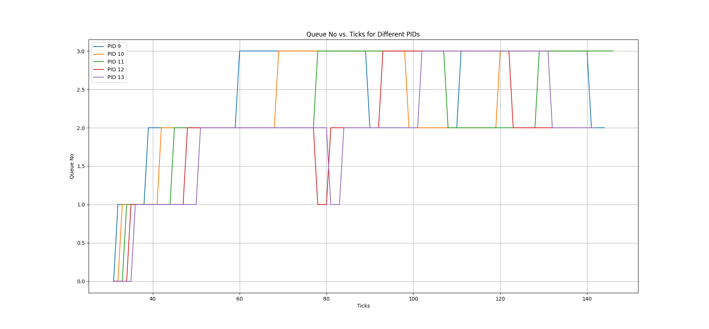

[](https://classroom.github.com/a/DLipn7os)
# Intro to Xv6
OSN Monsoon 2023 mini project 2

## Some pointers
- main xv6 source code is present inside `initial_xv6/src` directory. This is where you will be making all the additions/modifications necessary for the first 3 specifications. 
- work inside the `networks/` directory for the Specification 4 as mentioned in the assignment.
- Instructions to test the xv6 implementations are given in the `initial_xv6/README.md` file. 

- You are free to delete these instructions and add your report before submitting. 

# Implementation of Scheduling Algorithms

1. ## First Come First Serve (FCFS)
    - This algorithm basically works on the principle of the (First in First Out) that is out of all the runnable processes the process which beacame runnable first will be executed first.
    - This algorithm is non-preemptive in nature.

    ### Implementation
    - To implement this algorithm first of all, out of all the proccesses which are runnable we will select the one with the minimum arrival time.
    - This was performed in the scheduler function present in the proc.c file.
    - Iterate over the entire proc array and find a RUNNABLE process with the minimum arrival time.
    - Now just to ensure that the process which is selected is not being run by different CPU we will acquire the lock.
    - Now we set the process state to RUNNING and perform the context switch which runs the process.
    - The call to yield() functioin is not performed in case of this scheduler so that the process does not preempt the CPU and runs till it is completed.

2. ## Multilevel Feedback Queue (MLFQ)
    - This algorithm will schedule the processes on the basis of there priority.
    - We will have n number of queues in this algorithm.
    - Whenever we want to do a context switch the process with the highest priority will be executed.
    - If there are multiple processes with the same priority then the process which came first will be executed first.
    - If a process consumes a particular amount of a time slice for a queue then it will be demoted to the next queue.
    - If the wait time of a RUNNABLE process crossess a certain threshold then it will be promoted to the upper queue.
    - At any time if a new process enters any of the upper queue then it will preempt the process which is currently running without changing its priority.

    ### Implementation
    - We will have 4 queues numbered 0 to 3.
    - The first queue will have the highest priority and the last queue will have the lowest priority.
    - The time slice for the queues are as follows:
        - Queue 0: 1 ticks
        - Queue 1: 3 ticks
        - Queue 2: 9 ticks
        - Queue 3: 15 ticks
    - To maintain these queues I have created a struct named mlfq which stores the pointers to queues.
    - The structure of the struct  queue  and the struct mlfq is as follows:
        ```c
        struct queue {
            struct proc *p;
            struct queue *next;
        };
        ```
        ```c
        struct mlfq {
            struct queue *queue0;
            struct queue *queue1;
            struct queue *queue2;
            struct queue *queue3;
        };
        ```
    - Every new process is added to the queue 0.
    - In the scheduler function every time I call the context switch for the first RUNNABLE process in the highest possible priority queue.
    - For this I iterate over the queues starting from the highest priority queue and check if there is any RUNNABLE process in that queue.
    - If there is a RUNNABLE process in that queue then I call the context switch for that process.
    - If there is no RUNNABLE process in that queue then I move to the next queue and check for the RUNNABLE process in that queue.
    - This is done evrytime whenever a context switch is to be performed.
    - This ensures that every time we call the context switch the a RUNNABLE process in  the highest priority priority queue containiing at least one RUNNABLE process is excecuted.
    - Now for each process in its struct proc I maintian a variable named ticks_used_mlq which stores the number of ticks for which the process has been executed in the current queue.
    - In trap.c for timer interrupt I have added a check for the ticks_used_mlq variable.
    - If the ticks_used_mlq variable is greater than the time slice for the current queue then I demote the process to the next queue and preempt the process.
    - Also in the trap.c during the timer interrupt I have added a check for the presence of a RUNNABLE process in the in the upper queues;
    - If there is a RUNNABLE process in the upper queue then I preempt the current process which then enables context switch to happen to the RUNNABLE process in the upper queue.
    - For the wait ticks of a RUNNABLE process I have added a variable named wait_ticks in the struct proc.
    - Whenever a process is added to a queue or is promoted to a higher priority queue or returns to runnable state from sleep in the wakeup function I set the wait_ticks to ticks at that point of time .
    - To find the wait time of a process I have calculated the difference between the current ticks and the wait_ticks.
    - If the wait time of a RUNNABLE process other than the current process hits the threshold then I promote the process to the upper queue.
    - In this way I have implemented ageing in the MLFQ algorithm.

    ### Scheduling Analysis

    - I have used the following to run the scheduler:
        ```bash
        make qemu SCHEDULER=MLFQ CPUS=1
        ```
        - Then in the qemu window I have run the following command:
            ```bash
            schedulertest
            ```
    - For each of the process with pid 9,10,11,12,13 at every call to the update_time function I have printed the pid of the process and the current ticks and the current priority queue  of the process.

    - Then for each pid I plotted a line graph with the current ticks on the x-axis and the priority queue on the y-axis.
    
    - The graph obtained is as follows:
        

    - From the graph we can analyze that intially at the start all the processes are in the qeueu0.
    - In the schedulertest.c the processes with the pid 4 to pid 8 are I/O bound  processes and the processes with the pid 9 to pid 13 are CPU bound processes.
    - Initially pid 4 to 8 run for some time but before the end of 1 tick they go to sleep mode and hence there priority is not changed.
    - Next the process with pid 9 starts running and it runs for 1 tick and then it is preempted and it is moved to the queue1.
    - Similarly for the process with pid 10,11,12,13 they run for 1 tick and then they are preempted and moved to the queue1.
    - In between whenever any process with pid 4 to pid 8 wakes up the it is executed but it again preempts before 1 tick and hence its priority is not changed.
    - Now the process with pid 9,10,11,12,13 run for 3 ticks and then they are preempted and moved to the queue2.
    - So due to this we can observe that the process with pid 9 is moved to queue2 first after whichat interval of almost 3 ticks the process with pid 10,11,12,13 are moved to queue2 one by one in as they were added in this order in the priority queue due to which they are moved to queue2 in this order.

    - Now the process with the pid 9 runs for 9 ticks and then it is preempted and moved to queue3.
    - After this the process with pid 10 is also moved to queue3 after it uses 9 ticks in queue2.
    - Then the process with pid 11 is also moved to queue3 after it uses 9 ticks in queue2.
    - By that time the wait ticks for the pid 12 hits the threshold and hence it is promoted to queue1 where it runs for 3 ticks and then it is preempted and moved to queue2 again.
    - Similarly for the process with pid 13 its wiat ticks hit the threshold by the time pid 12 uses 3 ticks of queue2. DU to this it is promoted to queue1 and then it runs for 3 ticks and then it is preempted and moved to queue2.
    - By this time the pid 9 process hits the threshold for the wait ticks and hence is promoted to queue2.
    - Now all the processes toggle between queue2 and queue3 , promoting to queue2 when the wait ticks hit the threshold and demoting to queue3 when the ticks_used_mlq hits the time slice for queue2 that is 9 ticks.

         
# Performence COmparision between RR , FCFS and MLFQ

## Average Wait Time 


- ### FCFS
    - __For the FCFS algorithm the average wait time is 120 and average run time is 10.__
- ### MLFQ
    - __For the MLFQ algorithm the average wait time is 140 and average run time is 10.__
- ### RR
    - __For the RR algorithm the average wait time is 142 and average run time is 10.__

- __So we infer that the average wait time for the FCFS algorithm is the least and the average wait time for the RR and MLFQ algorithm is almost same with the average wait time of RR being slightly greatern than that of MLFQ.__

- __Also the average run time for all the three algorithms is same.__


